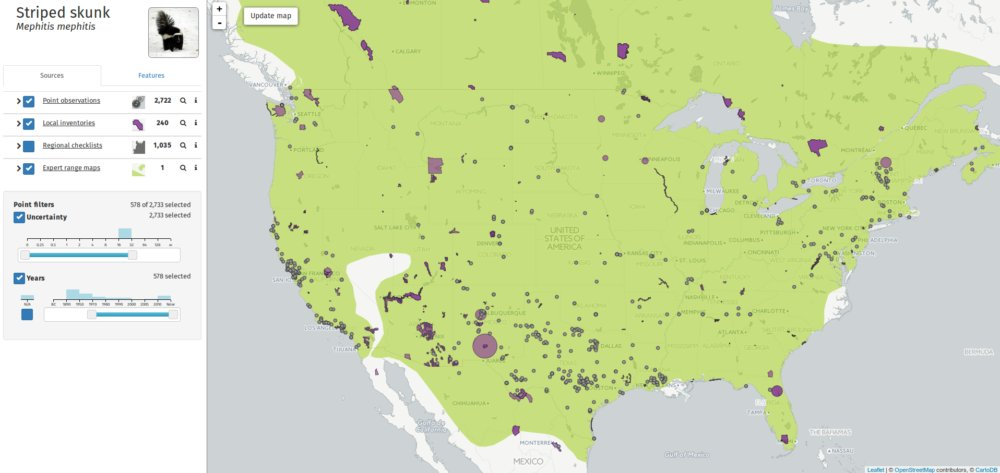
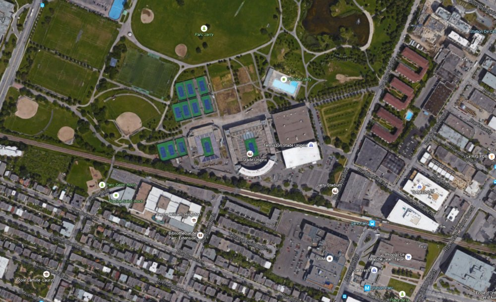

As [reported by BBC](http://www.bbc.com/sport/0/tennis/33951245), men's tennis World number one Novak Djokovic complained to the umpire that he could smell cannabis on court during his Rogers Cup win over Jeremy Chardy. After winning the first set, the Serb approached the chair, saying: 

> "Someone is smoking weed, I can smell it, I'm getting dizzy."

And later:

> "You can't believe how bad it was. ... Whoever it is, I hope he doesn't come back tomorrow. He's probably on the seventh sky somewhere." 

When I moved to the US in 2011, I also smelled cannabis everywhere, sometimes the foul smell crawled into the bedroom through the open window and woke me up.

Then I noticed that Americans smoke cannabis on highways -- actually, on empty highways in the middle of nowhere. Imagine that everything is quiet, you drive all alone through the hot summer night, no signs of a human being for miles, and all of a sudden the ventilation starts pumping in the smell of [Dutch Passion Skunk #1](http://www.dutch-passion.nl/en/cannabis-seeds/product/skunk-1/).

Then I learned what it really was:

Could Novak Djokovic in fact smell Striped skunk (*Mephitis mephitis*) instead of cannabis?

Let's check [Map of Life](http://species.mol.org/species/map/Mephitis_mephitis) if Striped skunk's geographic range covers Montreal (that's where semifinals of Rogers Cup take place):

And let's check if there are parks and gardens around the main tennis court:

Green suburbs everywere, ideal habitat for Striped skunk. So Novak Djokovic could have actually smell the animal instead of the plant.

But then I cannot really reject the possibility that someone really was smoking cannabis in the stadium. Actually, I wonder how many of the Striped skunk detection points in GBIF and Map of Life are, in fact, cannabis.

