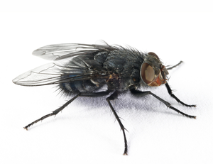

---
output:
  ioslides_presentation:
    widescreen: true
    smaller: true
author: Petr Keil
date: February 2015
title: Ahoj
---

Probability Density, Likelihood, and the Univariate Normal Model
========================================================


========================================================
The purpose of this lesson is to explain the concept of **probability density** 
and **likelihood**, using a simple example of **Normal** probability density function.

The data
========================================================

We will use data on **housefly wing length [mm]**, which you can find [here](http://www.seattlecentral.edu/qelp/sets/057/057.html). 

The original data are from Sokal & Hunter (1955) A morphometric analysis of DDT-resistant and non-resistant housefly strains *Ann. Entomol. Soc. Amer.* **48**: 499-507. 



The data
========================================================

To fetch the data directly from the web, run:

```r
wings <- read.table("http://goo.gl/4lPBG6", header=FALSE)[,1]*0.1
```

The data
========================================================


```r
wings
```

```
  [1] 3.6 3.7 3.8 3.8 3.9 3.9 4.0 4.0 4.0 4.0 4.1 4.1 4.1 4.1 4.1 4.1 4.2
 [18] 4.2 4.2 4.2 4.2 4.2 4.2 4.3 4.3 4.3 4.3 4.3 4.3 4.3 4.3 4.4 4.4 4.4
 [35] 4.4 4.4 4.4 4.4 4.4 4.4 4.5 4.5 4.5 4.5 4.5 4.5 4.5 4.5 4.5 4.5 4.6
 [52] 4.6 4.6 4.6 4.6 4.6 4.6 4.6 4.6 4.6 4.7 4.7 4.7 4.7 4.7 4.7 4.7 4.7
 [69] 4.7 4.8 4.8 4.8 4.8 4.8 4.8 4.8 4.8 4.9 4.9 4.9 4.9 4.9 4.9 4.9 5.0
 [86] 5.0 5.0 5.0 5.0 5.0 5.1 5.1 5.1 5.1 5.2 5.2 5.3 5.3 5.4 5.5
```

The data
========================================================

<small style="font-size:.7em">

```r
par(mfrow=c(1,2))
hist(wings, freq=TRUE, col="grey")
points(wings, jitter(rep(0, times=100), factor=10))
hist(wings, freq=FALSE, col="grey")
points(wings, jitter(rep(0, times=100), factor=0.7))
```

 
</small>

The Normal model
========================================================

This is our formal model definition:

$$ p(x) = \frac{1}{\sqrt{2\pi}\sigma}e^{-(x-\mu)^2/(2\sigma^2)} $$

where $p()$ is **probability density function** (also known as PDF). The function has two parameters: $\mu$ (mean) and $\sigma$ (standard deviation).

The Normal model
========================================================

For $\mu = 0$ and $\sigma = 1$ the model looks like this:

```r
  curve(dnorm, from=-4, to=4, ylab="p(x)")
```

 

**Remember:**
========================================================

* Probability density is different from probability.

* Probability density is denoted by $p$, while probability is $P$.

* Probability density can be higher than 1.

* Probability density function must integrate to 1.

* *Probability distribution* is a very ambiguous and confusing term.

# Fitting the model to the wing data

**KEY PROBLEM:** How do we decide which parametrization is the best for our data?

 


## Likelihood - single data point

The *likelihood function* is the **density** evaluated at the data $x_1$, ... ,$x_n$, viewed as a function of model parameters ($\mu$ and $\sigma$ in case of the Normal model). We write it as $L(\mu, \sigma | x) = p(x | \mu, \sigma)$.  

**Calculation of likelihood in R is easy!** The R functions ```dnorm()```, ```dpois()```, ```dunif()```, ```dbinom()```, ```dgamma()```, ```dbeta()``` etc. are exactly for that!

**Example:** What is the likelihood of the first data value in the `wings` dataset,  given the $Normal(\mu=4, \sigma=1)$ model?


```r
my.mean = 4
my.sd = 1
```

Here is the data point that we will examine. Note that I use the letter
i to denote index:


```r
wings.i <- wings[1]
wings.i
```

```
[1] 3.6
```

Here is how you calculate the likelihood for the data point `wings.i` using
the function `dnorm`:

```r
L <- dnorm(x=wings.i, mean=my.mean, sd=my.sd)
L
```

```
[1] 0.3683
```

Let's plot it:

```r
  curve(dnorm(x, my.mean, my.sd), from=0, to=7, 
        ylab="p(wings | mu, sigma)", xlab="wings",
        main=paste("p(wings.i | mu, sigma) = ", round(L, 4)))
  points(wings.i, 0)
  abline(v=wings.i, col="red")
  abline(h=L, col="red")
```

 

# Likelihood - whole dataset

Basic probability theory tells us that:

$$P(A \cap B) = P(A) \times P(B|A) = P(B) \times P(A|B) $$

Where $P(A \cap B)$ is **joint probability**, associated with *AND*, meaning
*"at the same time"*.

The problem is that joint probability for more than two events, 
e.g. $P( A \cap B \cap C \cap D )$, can be almost impossible to calculate, **with the exception of A and B being independent!** Then: 
$$P(A \cap B) = P(A) \times P(B) $$
and hence
$$ P( A \cap B \cap C \cap D ) = P(A) \times P(B) \times P(C) \times P(D)$$

It follows that it is useful to subject *probability density $p()$* to the same rules as *probability $P()$*. Hence, **we can calculate the likelihood of the whole dataset as a product of likelihoods of all individual data points!**


```r
  wings
```

```
  [1] 3.6 3.7 3.8 3.8 3.9 3.9 4.0 4.0 4.0 4.0 4.1 4.1 4.1 4.1 4.1 4.1 4.2
 [18] 4.2 4.2 4.2 4.2 4.2 4.2 4.3 4.3 4.3 4.3 4.3 4.3 4.3 4.3 4.4 4.4 4.4
 [35] 4.4 4.4 4.4 4.4 4.4 4.4 4.5 4.5 4.5 4.5 4.5 4.5 4.5 4.5 4.5 4.5 4.6
 [52] 4.6 4.6 4.6 4.6 4.6 4.6 4.6 4.6 4.6 4.7 4.7 4.7 4.7 4.7 4.7 4.7 4.7
 [69] 4.7 4.8 4.8 4.8 4.8 4.8 4.8 4.8 4.8 4.9 4.9 4.9 4.9 4.9 4.9 4.9 5.0
 [86] 5.0 5.0 5.0 5.0 5.0 5.1 5.1 5.1 5.1 5.2 5.2 5.3 5.3 5.4 5.5
```

```r
  L <- dnorm(x=wings, mean=my.mean, sd=my.sd)
  L
```

```
  [1] 0.3683 0.3814 0.3910 0.3910 0.3970 0.3970 0.3989 0.3989 0.3989 0.3989
 [11] 0.3970 0.3970 0.3970 0.3970 0.3970 0.3970 0.3910 0.3910 0.3910 0.3910
 [21] 0.3910 0.3910 0.3910 0.3814 0.3814 0.3814 0.3814 0.3814 0.3814 0.3814
 [31] 0.3814 0.3683 0.3683 0.3683 0.3683 0.3683 0.3683 0.3683 0.3683 0.3683
 [41] 0.3521 0.3521 0.3521 0.3521 0.3521 0.3521 0.3521 0.3521 0.3521 0.3521
 [51] 0.3332 0.3332 0.3332 0.3332 0.3332 0.3332 0.3332 0.3332 0.3332 0.3332
 [61] 0.3123 0.3123 0.3123 0.3123 0.3123 0.3123 0.3123 0.3123 0.3123 0.2897
 [71] 0.2897 0.2897 0.2897 0.2897 0.2897 0.2897 0.2897 0.2661 0.2661 0.2661
 [81] 0.2661 0.2661 0.2661 0.2661 0.2420 0.2420 0.2420 0.2420 0.2420 0.2420
 [91] 0.2179 0.2179 0.2179 0.2179 0.1942 0.1942 0.1714 0.1714 0.1497 0.1295
```

```r
  prod(L)
```

```
[1] 1.658e-50
```
This is a ridiculously small number!
Which is why we have the **Negative Log Likelihood**, also known as the **deviance**:

```r
  - sum(log(L))
```

```
[1] 114.6
```

We can encapsulate it into a single function:

```r
  deviance.function <- function(x, mean, sd)
  {
    LL <- dnorm(x=x, mean=mean, sd=sd, log=TRUE) # note the log!!!
    deviance <- - sum(LL)
    return(deviance)
  }

  # it's a function of model parameters, so try to play
  # around with different paramter values
  deviance.function(wings, mean=0, sd=1)
```

```
[1] 1135
```

Deviance (negative log-likelihood) can be then minimized (likelihood is maximized) in order to find the most likely model parameters - these are the **Maximum Likelihood Estimators (MLE)** of model parameters.

One can use ```optim()``` for automatic likelihood optimization.

# Exercise

**Find the MLE of the Normal model and the 'wings' data.** Use the following
functions and scripts:

```r
 mu = 4; sd = 1
 deviance.function(wings, mean=mu, sd=sd)
 hist(wings, freq=FALSE)
 curve(dnorm(x, mean=mu, sd=sd), add=TRUE)
```

# For further exploration

There are other functions derived from probability density functions. I have [a 
tutorial post](http://www.petrkeil.com/?p=2084) on that.

Type `?pnorm`, `?qnorm` or `?rnorm` and check it out:
