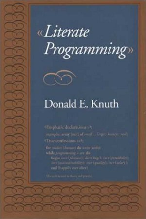
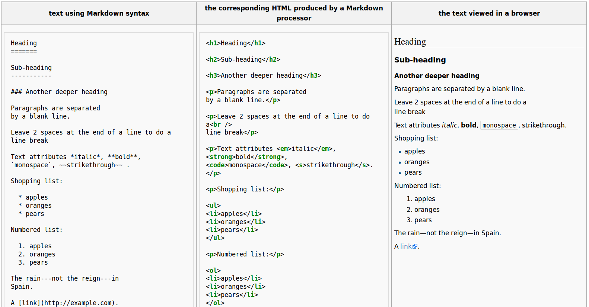

Dynamic scientific reports, literate programming, markup languages
========================================================
author: Petr Keil
date: 19 Feb 2016, iDiv, Leipzig, Germany

Example documents
========================================================

Literate programming
========================================================

An article by Donald E. Knuth from 1983 is [here](http://www.literateprogramming.com/knuthweb.pdf).

 

Literate programming
========================================================

[Literate Programming](http://www.literateprogramming.com/knuthweb.pdf) is an approach in which a program is given as an explanation of the program logic in a natural language, such as English, interspersed with **snippets of macros and traditional source code**.

Markup languages
========================================================

Markup languages
========================================================

Useful in science:

- html
- LaTeX
- Markdown

Markdown
========================================================

- syntax highlighted in emacs, gedit, vim
- editors: Atom, RStudio, Remarkable
- online editors: [stackedit](https://stackedit.io) 
- used in: [GitHub](https://github.com/)

R Markdown and `knitr`
========================================================

- inspired by [Sweave](http://www.statistik.lmu.de/~leisch/Sweave/)
- html documents
- pdf through LaTeX
- presentations

LaTeX
========================================================

Windows users need [MikTex](http://www.miktex.org/)

Ubuntu: `sudo apt-get install texlive`

Dozens of Tex editors [here](https://en.wikipedia.org/wiki/Comparison_of_TeX_editors)

Dozens of [templates](http://www.latextemplates.com/).

How is it all useful?
========================================================

- Can be dynamically **updated** any time.
- **Portability** -- it works on any operating system, it is open.
- **Reproducibility** -- readers know exactly what you did.
- **Self-containment** -- the code is always functional.
- **Readability** -- reader-friendly right away (great for pre-prints).
- **Version control (Git) friendly** -- it is all code.

Drawbacks
========================================================

- **Hard to collaborate** with people who don't use markup languages (and/or Git).
- Sometimes it is just easier to do stuff in MS Word
- Time consuming, sometimes tedious to do exactly what you want
- Not always useful for manuscripts

