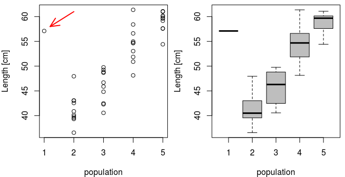
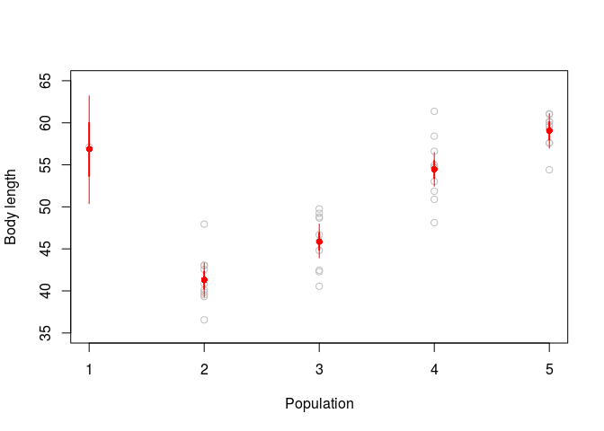
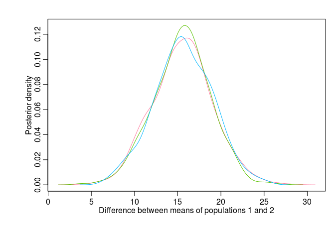
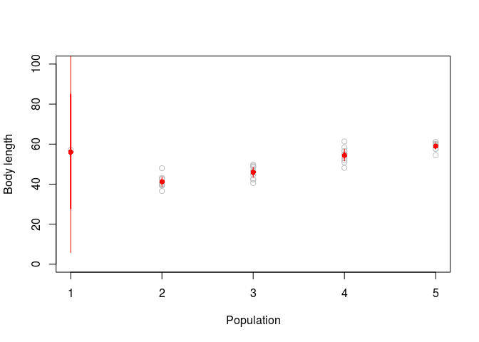
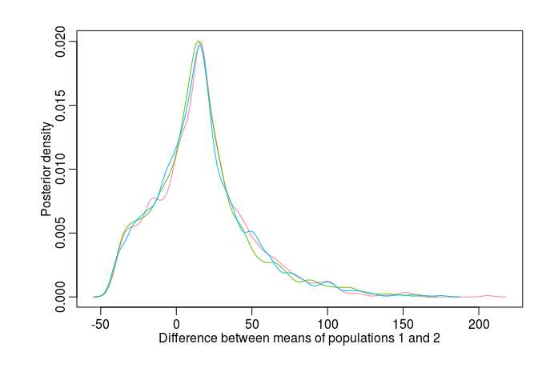

# Bayesian ANOVA: Powerful inference with within-group sample size of 1
Petr Keil  
March 2017  

***

This post is inspired by a question by Dylan Craven that he raised during my Bayesian stats course.

# Objective

My aim here is to demonstrate that, in Bayesian setting, one can make powerful inference about within-group ANOVA means $\mu_i$ even for groups with sample size $N=1$, i.e. groups with only a single measurement. The main reason this is possible is the assumption of constant variance ($\sigma^2$) among groups: groups with sufficiently large $N$ increase credibility of the $\sigma^2$ estimate, which limits the credible interval of $\mu$ in the group with $N=1$. Conversely, when the assumption is relaxed and $\sigma^2$ is allowed to vary, groups with sample size of 1 are no longer that useful.

# The data

I will use modified artificially-generated data from the example from [Marc Kery's Introduction to WinBUGS for Ecologists](https://www.mbr-pwrc.usgs.gov/software/kerybook/), page 119 (Chapter 9 - ANOVA). The (artificial) data are supposed to describe snout-vent lengths in five populations of Smooth snake (*Coronella austriaca*); I modified the data so that **the first population is only represented by a single observation**, as indicated by the arrow in the figure below.


***

Loading the data from the web:


```r
snakes <- read.csv("http://www.petrkeil.com/wp-content/uploads/2017/02/snakes_lengths.csv")
```

Plotting the data:


```r
par(mfrow=c(1,2), mai=c(0.8,0.8, 0.1, 0.1))
plot(snout.vent ~ population, data=snakes, ylab="Length [cm]")
arrows(x1=1.2, y1=58, x0=2, y0=61, col="red", lwd=2, angle=25, length=0.2)
boxplot(snout.vent ~ population, data=snakes, ylab="Length [cm]", xlab="population", col="grey")
```

<!-- -->

***

# Fixed-effects ANOVA in JAGS

First, I will model the data using a traditional fixed-effect ANOVA model. For a given snake $i$ in population $j$ **the model** can be written as:

$$y_{ij} \sim Normal(\mu_j, \sigma)$$

Where $\mu_j$ is a mean of $j$-th population ($j \in \{1,2,3,4,5\}$), and $i$ identifies individual measurements.

I am interested in a simple question: **Is there a statistically significant difference between population 1 and 2?** Will I be able to infere the difference even when population 1 has a sample size of 1? 

***

I will fit the model using MCMC in [JAGS](http://mcmc-jags.sourceforge.net/). Hence, I will prepare the data in a list format:


```r
snake.data <- list(y=snakes$snout.vent,
                   x=snakes$population,
                   N=nrow(snakes), 
                   N.pop=5)
```

Loading the library that enables R to communicate with JAGS:


```r
library(R2jags)
```

JAGS Model definition:


```r
cat("
  model
  {
    # priors
    sigma ~ dunif(0,100) # (you may want to use a more proper gamma prior)
    tau <- 1/(sigma*sigma)
    for(j in 1:N.pop)
    {
      mu[j] ~ dnorm(0, 0.0001)
    }
  
    # likelihood
    for(i in 1:N)
    {
      y[i] ~ dnorm(mu[x[i]], tau)
    }

    # the difference between populations 1 and 2:
    delta12 <- mu[1] - mu[2]
  }
", file="fixed_anova.txt")
```

And here I fit the model:


```r
model.fit.1 <- jags(data = snake.data, 
                    model.file = "fixed_anova.txt",
                    parameters.to.save = c("mu", "delta12"),
                    n.chains = 3,
                    n.iter = 20000,
                    n.burnin = 10000,
                    DIC = FALSE)
```

```
## Compiling model graph
##    Resolving undeclared variables
##    Allocating nodes
## Graph information:
##    Observed stochastic nodes: 41
##    Unobserved stochastic nodes: 6
##    Total graph size: 107
## 
## Initializing model
```

Plotting parameter estimates with `mcmcplots`:


```r
library(mcmcplots)

plot(snakes$snout.vent ~ snakes$population, ylim=c(35, 65), col="grey",
     xlab="Population", ylab="Body length")

caterplot(model.fit.1, parms="mu", horizontal=FALSE, 
          reorder=FALSE, add=TRUE, labels=FALSE, cex=2, col="red")
```

<!-- -->

The red dots and bars show posterior densities of $\mu$. Grey dots are the data.

***

**So what is the difference between population 1 and 2?**


```r
denplot(model.fit.1, parms="delta12", style="plain", mar=c(5,5,2,1), main="",
        xlab="Difference between means of populations 1 and 2", 
        ylab="Posterior density")
```

<!-- -->

There is a clear non-zero difference $\mu_1 - \mu_2$ (the posterior density does not overlap zero). So we can conclude that there is a statistically significant difference between populations 1 and 2, and we can conclude this despite having only $N=1$ for population 1. 

***

# Relaxing the assumption of constant variance

We can have a look what happens when the assumption of constant $\sigma$ is relaxed.
In other words, now every population $j$ has its own $\sigma$, and the model is:

$$y_{ij} \sim Normal(\mu_j, \sigma_j)$$

***

Here is JAGS definition of such model:


```r
cat("
  model
  {
    # priors
    for(j in 1:N.pop)
    {
      mu[j] ~ dnorm(0, 0.0001)T(0,) # Note that I truncate the priors here
      sigma[j] ~ dunif(0,100) # again, you may want to use proper gamma prior here
      tau[j] <- 1/(sigma[j]*sigma[j])
    }
  
    # likelihood
    for(i in 1:N)
    {
      y[i] ~ dnorm(mu[x[i]], tau[x[i]])
    }

    # the difference between populations 1 and 2:
    delta12 <- mu[1] - mu[2]
  }
", file="fixed_anova_relaxed.txt")
```

Let's fit the model:


```r
model.fit.2 <- jags(data = snake.data, 
                    model.file = "fixed_anova_relaxed.txt",
                    parameters.to.save = c("mu", "delta12"),
                    n.chains = 3,
                    n.iter = 20000,
                    n.burnin = 10000,
                    DIC = FALSE)
```

```
## Compiling model graph
##    Resolving undeclared variables
##    Allocating nodes
## Graph information:
##    Observed stochastic nodes: 41
##    Unobserved stochastic nodes: 10
##    Total graph size: 140
## 
## Initializing model
```

Here are parameter estimates plotted with `mcmcplots`


```r
library(mcmcplots)

plot(snakes$snout.vent ~ snakes$population, ylim=c(0, 100), col="grey",
     xlab="Population", ylab="Body length")

caterplot(model.fit.2, parms="mu", horizontal=FALSE, reorder=FALSE, add=TRUE,
          labels=FALSE, cex=2, col="red")
```

<!-- -->

Clearly, the posterior density of $\mu_1$ is essentially the priror. In other words, 
the single observation has little power on its own to overdrive the prior.

We can plot the posterior density of the difference $\mu_1 - \mu_2$


```r
denplot(model.fit.2, parms="delta12", style="plain", mar=c(5,5,2,1), main="",
        xlab="Difference between means of populations 1 and 2", 
        ylab="Posterior density")
```

<!-- -->

And we see that it is all over the place. Huge uncertainty, no clear inference is possible.

***

# Conclusion

I have shown that one can make powerful inference about population means even if the sample size for the population is super small (e.g. 1). This is possible when all of the following conditions are met: 

(1) Bayesian approach to ANOVA must be used.

(2) We must have sufficient data from other populations. 

(3) We must be confident that the assumption of constant variance among the groups is justified.


