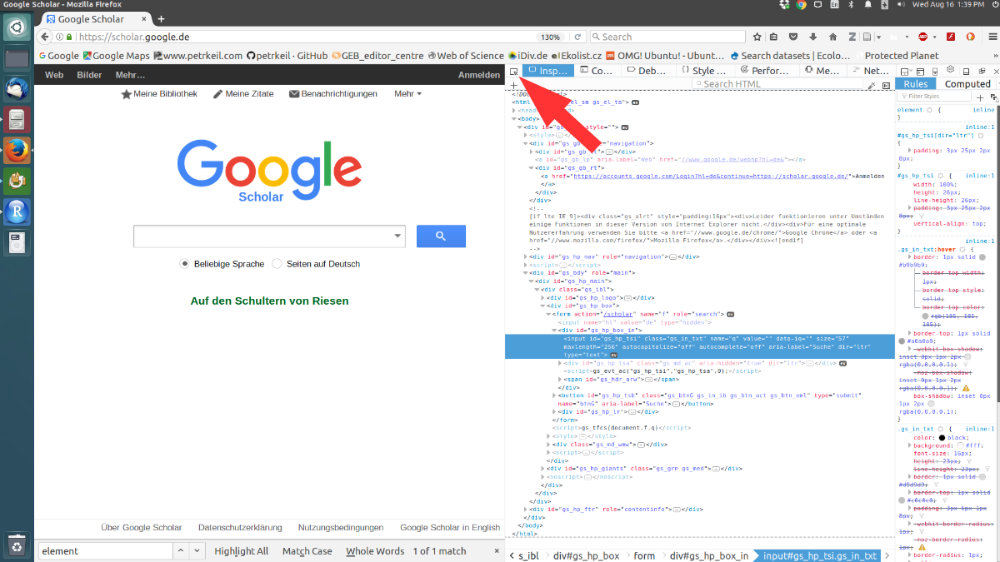

```{r setup, include=FALSE}
knitr::opts_chunk$set(echo = TRUE)
```

# Web scraping?

Web *scraping* is the metaphor used for the practice of getting data that weren't designed
to be programatically consumed off the web ([Dale 2016](http://kyrandale.com/blog/data-visualization-python-javascript/)). Almost any repetitive Web structure or pattern that you see in your browser can be 
scraped and turned to scientific data.

# Inspecting web elements

To do scraping, you need to be able to inspect *web elements*. In Firefox or Chrome you can hit `ctrl + shift + c` to invoke the element inspector. It looks like this:



\n \n

The red arrow shows the button which allows to identify the
elements on any web page using **locator schemes**. The most important locator schemes are: 

- [CSS selector](https://en.wikipedia.org/wiki/Cascading_Style_Sheets)
- id
- class
- [xpath](https://en.wikipedia.org/wiki/XPath)

You can right-click anywhere in the code, then `Copy` and select `CSS Selector`. Now it's in your clipboard, ready for R. In Google chrome you can also copy the xpaths.

Alternatively, check the [Selectorgadget](http://selectorgadget.com/) extension
for Chrome.

--------------------------------------------------------------------------------

# R packages for scraping

An overview of what R can do with the web is on the [web technologies CRAN Task View](https://cran.r-project.org/web/views/WebTechnologies.html).

Two important web-scraping R packages are:

- [rvest](https://github.com/hadley/rvest) by Hadley Wickham. This is part of Wickham's user-friendly *tidyverse*. It works great with *pipes* and packages such as `magrittr`, `lubridate` or `plyr`. The main element locator schemes are *CSS selectors* and *xpaths*. 
- [RSelenium](https://cran.r-project.org/web/packages/RSelenium/vignettes/RSelenium-basics.html) which is an R interface to [Selenium 2.0 WebDriver](https://seleniumhq.github.io/docs/wd.html). The Swiss army knife of R web scraping, it can work with all sorts of interactive web elements, and it works with many locator schemes, including *id*, *xpath*, *CSS selectors*, *classes* and so on.

For even more heavyweight scraping look at Python's package `Scrapy`.

--------------------------------------------------------------------------------

# Simple scraping with `rvest`

```{r, message=FALSE, warning=FALSE}
library(rvest)
library(magrittr) 
```

Note: It pays off to understand the pipe operator `%>%` when working with `rvest`.

## Example: downloading a simple html table

Here we will use `rvest` to download a [table with numbers of Nobel laureates](https://en.wikipedia.org/wiki/List_of_countries_by_Nobel_laureates_per_capita) in different countries from Wikipedia. 

First, I'll use the element locator in my browser (`ctrl + shift + c`) to get the *CSS selector* of the table. Then I'll download the entire web page to R, and parse it to XML using `read_html`, extract the table node using `html_node`, and then convert it to a `data_frame` using `html_table`:

```{r}
nobel.table <- read_html("https://en.wikipedia.org/wiki/List_of_countries_by_Nobel_laureates_per_capita") %>%
               html_node(css = "#mw-content-text > div > table:nth-child(9)") %>% 
               html_table()
```

Check the table:

```{r}
head(nobel.table)
```

We may still need some string operations (`gsub`, `grep`, `strsplit`, ...) to clean the data.


## Example: `data.frame` from a web structure that isn't a table

Here we will scrape a web structure that is not a table, but looks sufficiently regular ('pattern-ish') to be convertible to a table. It is a simple [list of Nobel laureates by country](https://en.wikipedia.org/wiki/List_of_Nobel_laureates_by_country). 

We'll need some more sophisticated work with the CSS selectors. Check out the element inspector in your browser first (`ctrl + shift + c`), and look for some common properties of the headers and the text.

First, download and parse the page with `read_html`, extract the country names with `html_nodes` using the CSS selector, and then convert the XML to text using `html_text`.  

```{r}
countries <- read_html("https://en.wikipedia.org/wiki/List_of_Nobel_laureates_by_country") %>%
             html_nodes(css = "h2 > span:first-child") %>% 
             html_text() 

countries <- countries[2:(length(countries)-2)]   # delete some non-country headings
countries <- append(countries, "Tibet", after=56) # we need to accomodate the 14th Dalai Lama
countries
```

Second, get the lists of laureates using exactly the same approach, but a different CSS selector:

```{r}
laureates <- read_html("https://en.wikipedia.org/wiki/List_of_Nobel_laureates_by_country") %>%
             html_nodes(css = "h2 ~ ol") %>% 
             html_text() %>% 
             strsplit(split="\n")
```

Finally, put the laureates and the countries together: 

```{r}
names(laureates) <- countries
laureates <- stack(laureates)
```

Let's check the resulting `data.frame`:

```{r}
head(laureates)
```

As in the previous example, we may need some string operations (`gsub`, `grep`, `strsplit`, ...) to further clean the data.

--------------------------------------------------------------------------------


# Advanced scraping with `RSelenium`

Interactive elements on the Web can be simple `html` forms, and these can be 
scarped with `rvest`. However, often there are forms, clickable buttons, interactive graphics 
and fill-in forms based on *JavaScript*, and for these we need some niftier tools.

With `RSelenium` you can create an R object virutally from any element of a webpage,
and you can emulate actions such as mouse clicks, you can fill-in forms, etc. -- you essentially 
give R your browser, your mouse and your keyboard, and you specify what R should do with these tools.

There is a really nice and [comprehensive tutorial](https://cran.r-project.org/web/packages/RSelenium/vignettes/RSelenium-basics.html). You can also open it by typing:

```{r, eval=FALSE}
vignette("RSelenium-basics", package = "RSelenium")
```


## Installation of `RSelenium`: Docker and Selenium Server

Installation of the R package is easy:

```{r, eval=FALSE}
install.packages("RSelenium")
```

However, to make `RSelenium` work, you may need to fiddle a bit, since it won't run on its own --
you need to install some additional stuff on your computer. You will need to install and run a **Selenium Server**. The most reliable way to do this is to use something called a **Docker container**. For instructions on how to set Docker and Selenium Server on your operating system type:

```{r, eval=FALSE}
vignette("RSelenium-docker", package = "RSelenium")
```

It took me about 2 hours to figure it out.

Also, before using `RSelenium`, you need to start the Selenium Server. I am on Ubuntu Linux, so do it in the terminal:

```
sudo docker run -d -p 4445:4444 selenium/standalone-firefox:2.53.0
sudo docker ps
```

## Example: Scraping biodiversity data from a page with interactive web elements

In this example we will interact with [GlobalTreeSearch form](http://www.bgci.org/global_tree_search.php?sec=globaltreesearch): we will fill in the genus and species fields, search the database, and retrieve the results, all from within R.

First, explore the page with the element inspector in your browser first (`ctrl + shift + c`).

To interact with the page, I've written a simple function `get.tree` which takes the `genus` and `species` arguments (character strings), and returns countries in which the species occurs -- the comments should make the idea quite obvious:

```{r}
get.tree <- function(genus, species)
{
  require(RSelenium)
  
  # open the remote driver
  remDr <- remoteDriver(port = 4445L)
  remDr$open(silent = TRUE)
  # 
  # go to the webpage
  remDr$navigate("http://www.bgci.org/global_tree_search.php?sec=globaltreesearch")
  remDr$refresh() # refresh the page
  
  # create R objects from the website elements
  genusElem <- remDr$findElement(using = 'id', value = "genus-field")
  specElem <- remDr$findElement(using = 'id', value = "species-field")
  buttElem <- remDr$findElement(using = 'class', value = "btn_ohoDO")
  
  # fill in the forms with the genus and species names
  genusElem$sendKeysToElement(list(genus))
  specElem$sendKeysToElement(list(species))
  
  # click the search button
  buttElem$clickElement()
  
  # get the output
  out <- remDr$findElement(using = "css", value="td.cell_1O3UaG:nth-child(4)")
  out <- out$getElementText()[[1]] # extract the actual text string
  out <- strsplit(out, split="; ")[[1]] # split the text to a character vector
  
  # close the remote driver
  remDr$close()
  
  return(out)  
}
```

Let's try it out:

```{r}
get.tree("Abies","alba")
```

# Other ideas, notes, useful stuff

- **Chrome developer tools**: there is more to them then just the elements tab. Have a look at Network for live monitoring and console for direct interaction (js). Ressource http://discover-devtools.codeschool.com

- **tcpdump/wireshark** can inspect the actual network traffic (also outside of the browser).

- **wget** and curl for fetching directly accessible data. They have switches for authentication and user agent (string that client supplies to server to communicate capabilities).

- Knowledge of **regular expressions** 

--------------------------------------------------------------------------------

# Session information

```{r}
sessionInfo()
```


